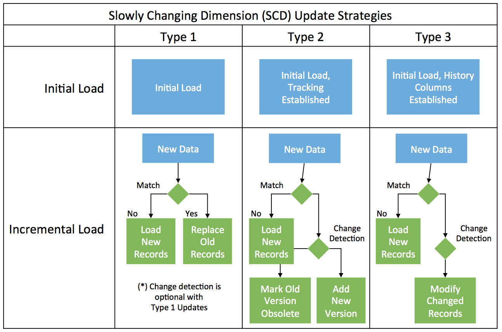

# Managing Slowly Changing Dimensions (SCDs) with Apache Hive

This project provides sample datasets and scripts that demonstrate how to manage Slowly Changing Dimensions (SCDs) with Apache Hive's ACID MERGE capabilities. Using ACID MERGE allows all updates to be applied atomically, ensure readers see all updates or no updates, and handles failure scenarios, rather than requiring application developers to build these things themselves.

Also included is data that simulates a full data dump from a source system, followed by another data dump taken later.

The objective is to merge the data using different styles of [slowly-changing dimension strategies](https://en.wikipedia.org/wiki/Slowly_changing_dimension)

These examples cover [Type 1](hive_type1_scd.sql), [Type 2](hive_type2_scd.sql) and [Type 3](hive_type3_scd.sql) updates.

## Procedure

## Requirements

* [Hortonworks Data Platform](https://hortonworks.com/downloads/) (HDP) 2.6 or later
* OR [Apache Hive](https://hive.apache.org/) 2.2 or later

## Instructions

* Clone this repository onto your Hadoop cluster
* Run load_data.sh to stage data into HDFS
* From Hive CLI or beeline, run `hive_type1_scd.sql`, `hive_type2_scd.sql` and `hive_type3_scd.sql`
